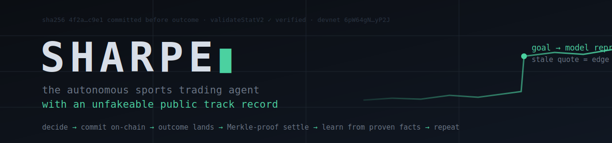
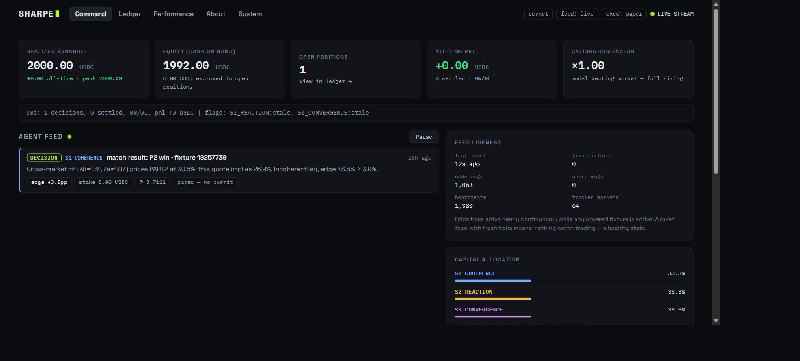
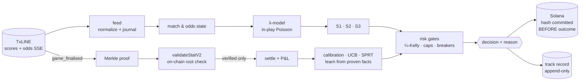

<div align="center">



<br/>

[](services/agent/test)
[](services/agent/test/determinism.test.ts)
[](tsconfig.base.json)
[](https://explorer.solana.com/?cluster=devnet)
[](https://txline.txodds.com)
[](https://earn.superteam.fun)

**Every betting "expert" can fake their track record. SHARPE can't lie.**

*It watches every World Cup match in real time, prices every outcome, trades mispricings with USDC —*
*and every decision is hashed onto Solana **before** the result exists. Settlement is a Merkle proof, not a promise.*

</div>

---

## Why this exists

The sports-trading world runs on unverifiable claims: tipsters with cherry-picked screenshots, bots whose losing runs quietly disappear, "verified" records hosted by whoever profits from them. Meanwhile prediction markets settle through oracle committees and dispute windows — humans, again.

SHARPE deletes the human from both ends of the trust problem:

- 🧠 **It decides alone.** A deterministic pricing brain — no LLM, no black box, no manual approvals. Same input → same decision → same hash. Always. *(Proven by test, bit-for-bit, [across the full pipeline](services/agent/test/determinism.test.ts) — and confirmed on real match data across independent runs.)*
- ⛓️ **It commits before the outcome.** Every decision's canonical hash lands on Solana while the ball is still rolling. Backdating, pruning, or "forgetting" a loss is cryptographically impossible.
- ⚖️ **It settles by proof, no referee.** When TxLINE publishes a match's `game_finalised` record, SHARPE fetches the Merkle proof and verifies the result against the daily root TxODDS anchored **on-chain** — via the TxLINE program's `validateStatV2`. **No verified proof → no settlement.** Local data alone can never move money.
- 📉 **It learns only from facts it can prove.** Stake sizing shrinks when its calibration slips, capital flows toward strategies with proven ROI, and a statistically broken strategy **suspends itself** — every adaptation a pure function of the settled, on-chain-verifiable history.

Built for the **TxODDS World Cup Hackathon — Track 2 (Trading Tools & Agents)**. Designed to outlive it.

---

## The proof — a real semifinal, settled by math

England 1–2 Argentina (fixture `18241006`, World Cup semifinal). SHARPE submits the final-score Merkle proof to the TxLINE program on Solana devnet, twice:

```text
[1/2] TRUE claim — "participant 2 won" (goals P1 − P2 < 0):
  verified: true  | proven stats: [{key:1, value:1, period:100}, {key:2, value:2, period:100}]

[2/2] FALSE claim — "participant 1 won" (goals P1 − P2 > 0):
  verified: false

RESULT: settlement primitive PROVEN — the on-chain Merkle root accepts
the true outcome and rejects the false one.
```

The chain accepted the truth and rejected the lie. That single mechanic is the entire product: a trading agent whose wins, losses, and settlements are **checkable by anyone, trusted by no one**. Reproduce it yourself: `npx tsx tools/verify-proof.ts` ([source](services/agent/tools/verify-proof.ts)).

<div align="center">



*The production frontend, live on devnet — a real decision with its reasoning, live vitals, and the agent's self-regulation, all streamed over SSE.*

</div>

---

## Watch it think

Every decision ships with its full reasoning, in plain language, streamed live over SSE. From a real World Cup semifinal replayed through the live pipeline:

```text
[decide] S2_REACTION 50 USDC on OVER (Total Goals FT 2.5) @ 1.8763
         Goal at seq 2 repriced this match; quote is 298s older than the event.
         Model now 71.5% for OVER, stale quote implies 53.3%, edge +18.2%.

[settle] fixture 18241006 finalised 1-2; settling 8 position(s)
[settle] proof VERIFIED on-chain — goals(P1)−goals(P2) = -1 → PART2
[review] Predictions and outcomes consistent this match.
         S2_REACTION: 3 decisions, 1 win, −43.58 USDC — under SPRT watch.
```

That last line is the part most agents don't have: **SHARPE grades its own homework** — publicly, on-chain, after every match — and puts its own underperforming strategy on statistical probation.

---

## How it thinks

The market itself is the prior: TxLINE's de-margined consensus (1X2 + totals) pins down goal expectancies (λ_home, λ_away) for an in-play Poisson model. Live state — score, red cards, minutes remaining — conditions the model; three deterministic strategies trade the deviations:

| Strategy | Fires on | The edge it captures |
|---|---|---|
| **S1 · COHERENCE** | odds update | markets that disagree with their own jointly-fitted model — pure cross-market arithmetic |
| **S2 · REACTION** | goal / red card | quotes that lag the event repricing — speed + math, not prediction |
| **S3 · CONVERGENCE** | drift, no event | quotes that ran from consensus without any news — fade the drift |

Sizing is quarter-Kelly, scaled by two live feedback loops: **calibration** (rolling Brier of model vs market on settled decisions — stakes shrink when the model stops beating the market) and **allocation** (deterministic UCB over each strategy's realized ROI). A per-strategy **SPRT** self-suspends anything statistically underperforming its own stated probabilities; it keeps trading in shadow mode and re-arms itself after a clean run.

One design law governs the whole market surface: **if an outcome can't be proven on-chain as a single binary predicate, SHARPE doesn't trade it.**



---

## Engineering guarantees (each one enforced by test)

| Guarantee | Mechanism | Evidence |
|---|---|---|
| Same input → same decision, bit-for-bit | pure decision core, no wall-clock/randomness in the path | [determinism.test.ts](services/agent/test/determinism.test.ts) + identical equity across independent real-data runs |
| `kill -9` loses nothing | full risk + intelligence state rebuilt from the append-only ledger on boot | [boot-rebuild.test.ts](services/agent/test/boot-rebuild.test.ts) |
| A commitment can never be silently lost | write-ahead journal before broadcast; boot reconcile; retried forever | [commit-wal.test.ts](services/agent/test/commit-wal.test.ts) |
| No verified proof → no settlement | `validateStatV2` result is law; failed proofs leave positions open for retry | [agent.ts settle path](services/agent/src/agent.ts) |
| Bad data can't poison the book | degenerate-quote rejection, NaN guards, stale-quote gate, drawdown breaker | [risk.test.ts](services/agent/test/risk.test.ts) |
| Feeds drop, agent doesn't | SSE auto-reconnect with resume, JWT renewal, idle watchdogs, contained event errors | [platform/sse.ts](services/agent/src/platform/sse.ts) |

---

## Run it in 60 seconds

```bash
git clone https://github.com/Ritik200238/sharpe && cd sharpe
npm install

# replay a match through the full pipeline (no credentials needed)
npx tsx services/agent/tools/synthesize.ts
npm run replay --workspace services/agent -- --replay-dir data/synthetic

# watch it think
open http://localhost:8787            # live dashboard
curl -N localhost:8787/stream         # the brain feed, raw SSE
```

With TxLINE credentials (one-time, ~1 min — a devnet wallet self-subscribes on-chain, free tier):

```bash
npm run setup  --workspace services/recorder   # wallet → airdrop → subscribe → activate
npm run start  --workspace services/agent      # goes live on the real feeds, unattended
```

**Read-only API** (what judges can poke):

| Endpoint | What it shows |
|---|---|
| `/status` | brain state, equity, allocations, calibration, 30-day digest summary |
| `/stream` | live SSE feed of every decision/settlement/review (`?strategy=`, `?fixtureId=`, Last-Event-ID resume) |
| `/decisions` · `/positions` · `/settlements` · `/reviews` | the glass box, record by record |
| `/track-record` | the full auditable ledger in one call |
| `/digest?days=30` | season scorecard per strategy + inactivity flags |
| `/health` | liveness + phase |

---

## Repository layout

```
services/agent/          the product — autonomous trading agent
  src/feed/              SSE live feed + replay feed (one interface, identical semantics)
  src/state/             match state (phases, stat keys) · consensus odds state
  src/model/             Shin de-vig · market-implied λ solver · in-play Poisson pricing
  src/strategy/          S1/S2/S3 · decision engine · canonical hashing
  src/risk/              fractional Kelly · exposure caps · drawdown breaker
  src/intelligence/      calibration · UCB allocation · SPRT self-suspension · digests
  src/exec/              write-ahead on-chain commitments (Solana)
  src/settle/            proof planning + validateStatV2 verification
  src/track/             append-only, event-sourced public track record
  src/api/               dashboard · status API · live SSE brain feed
  tools/                 verify-proof · 20-match backtest · synthetic match generator
  test/                  36 tests: model math, intelligence, WAL crashes, bit-for-bit determinism
services/recorder/       TxLINE signup + raw stream recorder + historical backfill
data/recordings/         20 real World Cup knockout matches (scores + odds journals)
PLAN.md · DECISIONS.md   how this was designed, and why
```

---

## TxLINE integration (the data layer)

SHARPE is built end-to-end on [TxLINE](https://txline.txodds.com) — TxODDS' cryptographically anchored sports data layer. Endpoints used:

| Purpose | Endpoint |
|---|---|
| Guest session | `POST /auth/guest/start` |
| On-chain free-tier subscribe → API activation | TxLINE program `subscribe` + `POST /api/token/activate` |
| Live scores (SSE) | `GET /api/scores/stream` |
| Live consensus odds (SSE) | `GET /api/odds/stream` |
| Fixture discovery | `GET /api/fixtures/snapshot` |
| Historical match recovery | `GET /api/scores/historical/{fixtureId}` · `GET /api/odds/updates/{fixtureId}` |
| Settlement proofs | `GET /api/scores/stat-validation?fixtureId&seq&statKeys` |
| **On-chain verification** | **`validateStatV2` CPI-able instruction** — devnet `6pW64gN1s2uqjHkn1unFeEjAwJkPGHoppGvS715wyP2J` |

Our devnet subscription is itself on-chain: [`XeNPJG…x6Kxm`](https://explorer.solana.com/tx/XeNPJGSyBW9XUVXiPTqjsPMyWCBUgy3BwwNB1eRHn7bZiiviCejQLoMfFZMrgra94E5uk4PLcnBsZioeoax6Kxm?cluster=devnet).

**What we loved:** the `llms.txt` docs index, the runnable devnet examples repo, `Pct` shipping de-margined consensus probabilities, and `game_finalised` (statusId 100) as a single settlement marker across regulation/ET/penalties. **Friction we hit:** the historical endpoint returns SSE-formatted text where the docs imply JSON arrays; devnet faucet quotas (not TxODDS' fault) gate first-time onboarding; `seq` semantics for proofs deserve a doc box of their own. Full notes in [DECISIONS.md](DECISIONS.md).

---

## Track 2 scorecard — how SHARPE maps to the judging criteria

| Criterion | Where SHARPE answers it |
|---|---|
| **Core functionality & data ingestion** | dual SSE streams, raw-fidelity journals, replay-identical pipeline, 20-match real corpus |
| **Autonomous operation** | one command → discovers fixtures, trades, settles, learns, recovers from crashes — zero human input (config at deploy only) |
| **Logic & code architecture** | deterministic glass-box: every decision carries its math and its reason; 36 tests; frozen decision-path discipline |
| **Innovation & novelty** | commit-before-outcome + proof-gated settlement + an agent that statistically audits **itself** — a track record that cannot be faked |
| **Production readiness** | write-ahead commitment journal, boot reconcile, self-healing feeds, exposure caps, drawdown breakers, live 24/7 on devnet |

**Submission package:** the full requirement-by-requirement status, `judge.md` + `CLAUDE.md`
compliance audit, and API feedback live in **[SUBMISSION.md](SUBMISSION.md)**. The turnkey
5-minute demo-video script is in **[DEMOVIDEO.md](DEMOVIDEO.md)**; deployment (Vercel
frontend + Dockerized agent) in **[docs/DEPLOY.md](docs/DEPLOY.md)**.

---

## Roadmap

- **On-chain escrow markets + vault** ([Anchor design + honest toolchain status](programs/README.md)) — USDC positions held in PDAs, settlement CPIs into `validateStatV2`, payouts released by proof
- **The agent's bankroll** — non-custodial deposits riding the agent's provable performance
- **Third-party strategists** — anyone deploys a strategy; every strategy inherits the same unfakeable accountability
- Mainnet, audits, and the venue-agnostic execution layer

---

<div align="center">

*SHARPE is a technology demonstration on Solana devnet using TxLINE data under the World Cup hackathon terms.
Nothing here is gambling services or financial advice.*

**decide → commit → prove → settle → learn → repeat**

</div>
